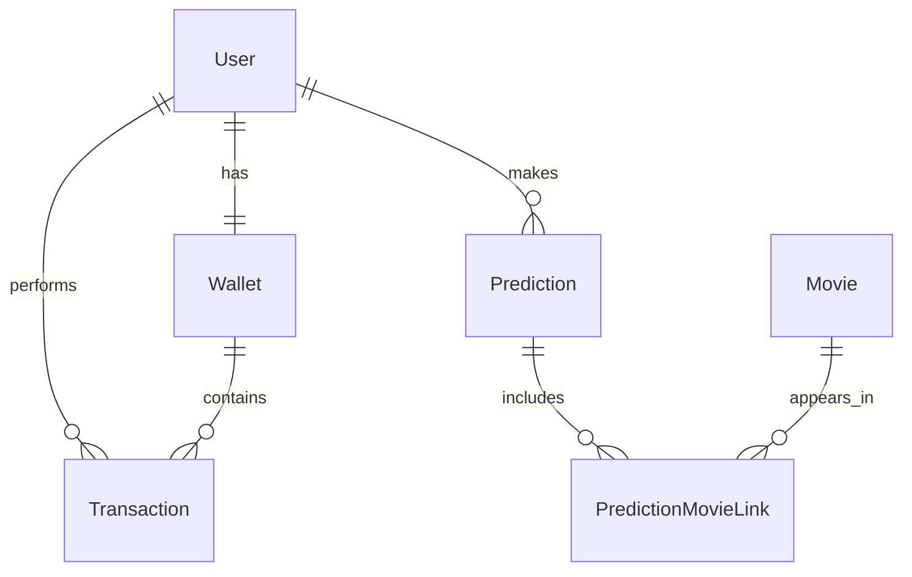

# 🏗️ Архитектура ML сервиса рекомендаций фильмов

## 📋 Обзор системы

ML сервис представляет собой микросервисную архитектуру, состоящую из нескольких контейнеров, каждый из которых отвечает за определенную функциональность. Система построена на принципах разделения ответственности, масштабируемости и отказоустойчивости.

## 🐳 Архитектура контейнеров

```
┌─────────────────┐    ┌─────────────────┐    ┌─────────────────┐
│   Web Browser  │    │   Mobile App    │    │  Telegram Bot   │
└─────────┬───────┘    └─────────┬───────┘    └─────────┬───────┘
          │                      │                      │
          └──────────────────────┼──────────────────────┘
                                 │
                    ┌─────────────▼─────────────┐
                    │      Nginx (Port 80)      │
                    │     (Reverse Proxy)       │
                    └─────────────┬─────────────┘
                                  │
                    ┌─────────────▼─────────────┐
                    │    FastAPI App (Port 8000)│
                    │   (Main Application)      │
                    └─────────────┬─────────────┘
                                  │
          ┌───────────────────────┼───────────────────────┐
          │                       │                       │
┌─────────▼─────────┐  ┌─────────▼─────────┐  ┌─────────▼─────────┐
│   PostgreSQL      │  │     RabbitMQ      │  │   ML Worker      │
│   (Port 5432)     │  │   (Port 5672)     │  │   (Port 8001)    │
│   + pgvector      │  │   + Management    │  │   (ML Service)   │
└───────────────────┘  └───────────────────┘  └───────────────────┘
```

## 🔧 Основные компоненты

### 1. **Nginx (web-proxy)**
- **Роль**: Обратный прокси-сервер
- **Порт**: 80 (HTTP)
- **Функции**:
  - Маршрутизация запросов к FastAPI приложению
  - Статическое обслуживание файлов
  - Балансировка нагрузки (готовность к масштабированию)
  - SSL termination (в production)

### 2. **FastAPI App (app)**
- **Роль**: Основное веб-приложение
- **Порт**: 8000
- **Функции**:
  - REST API endpoints
  - Web UI (HTML страницы)
  - Аутентификация и авторизация
  - Бизнес-логика
  - Интеграция с базой данных
  - RPC клиент для ML сервиса

### 3. **PostgreSQL (database)**
- **Роль**: Основная база данных
- **Порт**: 5432
- **Расширения**: pgvector для векторных операций
- **Функции**:
  - Хранение данных пользователей
  - Хранение информации о фильмах
  - Векторные эмбеддинги фильмов
  - История предсказаний
  - Транзакции и балансы

### 4. **RabbitMQ (rabbitmq)**
- **Роль**: Message broker для RPC
- **Порт**: 5672 (AMQP), 15672 (Management UI)
- **Функции**:
  - RPC коммуникация между app и ml_worker
  - Очередь сообщений для асинхронной обработки
  - Управление через веб-интерфейс

### 5. **ML Worker (ml_worker)**
- **Роль**: ML сервис для генерации эмбеддингов
- **Порт**: 8001 (внутренний)
- **Функции**:
  - Генерация векторных эмбеддингов
  - Обработка текстовых запросов
  - ML модели (Sentence Transformers)

## 🔄 Потоки данных

### 1. **Запрос рекомендаций**
```
User → Nginx → FastAPI → RabbitMQ → ML Worker → FastAPI → Database → User
```

1. Пользователь отправляет запрос через Web UI
2. Nginx проксирует запрос к FastAPI приложению
3. FastAPI проверяет авторизацию и баланс пользователя
4. Запрос отправляется в RabbitMQ для ML Worker
5. ML Worker генерирует эмбеддинг запроса
6. FastAPI выполняет векторный поиск в базе данных
7. Результаты возвращаются пользователю

### 2. **Регистрация пользователя**
```
User → Nginx → FastAPI → Database → User
```

1. Пользователь заполняет форму регистрации
2. FastAPI валидирует данные (email, пароль)
3. Создается пользователь в базе данных
4. Создается кошелек с начальным бонусом
5. Возвращается подтверждение

### 3. **Загрузка фильмов**
```
System → FastAPI → ML Worker → Database
```

1. При запуске системы сканируются JSON файлы
2. Для каждого фильма генерируется эмбеддинг
3. Данные сохраняются в базу с векторными представлениями

## 🗄️ Модели данных

### Core Entities



### 1. **User**
- Основная сущность пользователя
- Содержит email, хеш пароля, флаг администратора
- Связан с кошельком и предсказаниями

### 2. **Wallet**
- Управление балансом пользователя
- Связан с транзакциями
- Автоматически создается при регистрации

### 3. **Movie**
- Информация о фильмах
- Включает векторные эмбеддинги (384-мерные)
- Поддерживает многоязычные описания

### 4. **Prediction**
- История запросов пользователей
- Содержит исходный текст и результаты
- Связан с фильмами через связующую таблицу

### 5. **Transaction**
- Записи всех финансовых операций
- Типы: deposit, withdrawal, prediction, admin_adjustment
- Отслеживание изменений баланса

## 🔐 Система безопасности

### Аутентификация
- **HTTP Basic Auth** для API endpoints
- Валидация сложности паролей
- Rate limiting для предотвращения брутфорса

### Авторизация
- Защищенные endpoint'ы для критичных операций
- Проверка прав доступа к ресурсам
- Разделение ролей (пользователь/администратор)

### Security Middleware
- Security headers (XSS, CSRF защита)
- Trusted Host validation
- CORS с ограниченными origins
- Логирование безопасности

## 📡 API Architecture

### REST Endpoints
```
/api/
├── / (root) - информация о сервисе
├── /health - проверка состояния
├── /users/
│   ├── /signup - регистрация
│   ├── /signin - аутентификация
│   ├── /balance - получение баланса
│   ├── /balance/adjust - изменение баланса
│   └── /transaction/history - история транзакций
└── /events/
    ├── /prediction/history - история предсказаний
    └── /prediction/new - новые предсказания
```

### Web UI Routes
```
/web
├── / - главная страница
├── /prediction-history - история предсказаний
└── /transaction-history - история транзакций
```

## 🔄 RPC Communication

### RabbitMQ RPC Pattern
```python
# Клиент (FastAPI)
response = ml_service_rpc.call(message)

# Сервер (ML Worker)
def on_request(ch, method, props, body):
    # Обработка запроса
    # Генерация эмбеддинга
    # Возврат результата
```

### Message Format
```json
{
  "text": "текст запроса пользователя",
  "timestamp": "2025-08-19T12:00:00Z"
}
```

### Response Format
```json
{
  "request_embedding": [0.1, 0.2, ...],
  "processing_time": 0.15,
  "model_version": "all-MiniLM-L6-v2"
}
```

## 🚀 Масштабируемость

### Горизонтальное масштабирование
- **FastAPI**: Множество экземпляров за Nginx
- **ML Worker**: Несколько воркеров для параллельной обработки
- **Database**: Read replicas для запросов

### Вертикальное масштабирование
- Увеличение ресурсов контейнеров
- Оптимизация запросов к базе данных
- Кэширование результатов ML модели

## 🔍 Мониторинг и логирование

### Логирование
- **Structured logging** через Loguru
- **Security logging** для отслеживания доступа
- **Performance monitoring** для метрик производительности

### Метрики
- Время ответа API
- Количество запросов
- Использование ресурсов
- Статистика ML модели

## 🛠️ Развертывание

### Docker Compose
```yaml
services:
  app:
    build: ./app
    depends_on:
      - database
      - rabbitmq
    healthcheck:
      test: ["CMD", "python", "-c", "import urllib.request; urllib.request.urlopen('http://localhost:8000/health')"]
  
  ml_worker:
    build: ./ml_worker
    depends_on:
      - rabbitmq
  
  database:
    image: ankane/pgvector:v0.5.1
    environment:
      POSTGRES_DB: movie_recommender
  
  rabbitmq:
    image: rabbitmq:3.13.1-management-alpine
    ports:
      - "5672:5672"
      - "15672:15672"
  
  web-proxy:
    build: ./nginx
    depends_on:
      app:
        condition: service_healthy
```

### Environment Variables
- **app/.env**: Настройки основного приложения
- **ml_worker/.env**: Настройки ML сервиса
- **docker-compose.yaml**: Общие настройки

## 🔮 Будущие улучшения

### Краткосрочные
- Переход на JWT токены
- Добавление HTTPS
- Улучшенный мониторинг

### Среднесрочные
- GraphQL API
- Микросервисная архитектура
- Kubernetes развертывание

### Долгосрочные
- AI-powered рекомендации
- Мультимодальные эмбеддинги
- Real-time обновления

## 📚 Дополнительные ресурсы

- [README.md](README.md) - Общее описание проекта
- [SECURITY_RECOMMENDATIONS.md](SECURITY_RECOMMENDATIONS.md) - Рекомендации по безопасности
- [app/data/README.md](app/data/README.md) - Описание данных фильмов
